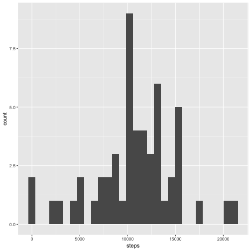
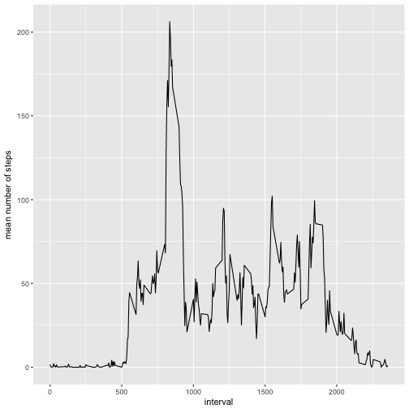
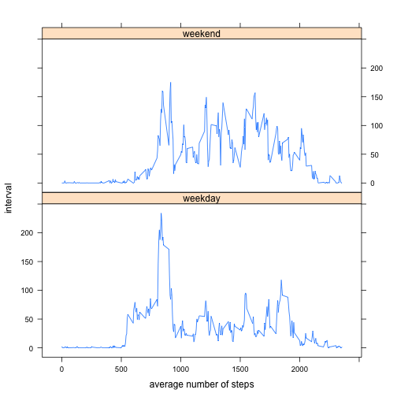

## Loading and preprocessing the data

Read the zipped file and convert the date variable from "Factor" to "Date".

```r
data <- read.table(unz("activity.zip", "activity.csv"), header = TRUE, sep = ",", na.strings = "NA")
data$date <- as.Date(data$date, "%Y-%m-%d")
```


## What is mean total number of steps taken per day?

1. Calculate the total number of steps taken per day.

```r
sum.steps.day <- aggregate(data$steps, by = list(data$date), FUN = sum)
names(sum.steps.day) <- c("date", "steps")
sum.steps.day
```

```
##          date steps
## 1  2012-10-01    NA
## 2  2012-10-02   126
## 3  2012-10-03 11352
## 4  2012-10-04 12116
## 5  2012-10-05 13294
## 6  2012-10-06 15420
## 7  2012-10-07 11015
## 8  2012-10-08    NA
## 9  2012-10-09 12811
## 10 2012-10-10  9900
## 11 2012-10-11 10304
## 12 2012-10-12 17382
## 13 2012-10-13 12426
## 14 2012-10-14 15098
## 15 2012-10-15 10139
## 16 2012-10-16 15084
## 17 2012-10-17 13452
## 18 2012-10-18 10056
## 19 2012-10-19 11829
## 20 2012-10-20 10395
## 21 2012-10-21  8821
## 22 2012-10-22 13460
## 23 2012-10-23  8918
## 24 2012-10-24  8355
## 25 2012-10-25  2492
## 26 2012-10-26  6778
## 27 2012-10-27 10119
## 28 2012-10-28 11458
## 29 2012-10-29  5018
## 30 2012-10-30  9819
## 31 2012-10-31 15414
## 32 2012-11-01    NA
## 33 2012-11-02 10600
## 34 2012-11-03 10571
## 35 2012-11-04    NA
## 36 2012-11-05 10439
## 37 2012-11-06  8334
## 38 2012-11-07 12883
## 39 2012-11-08  3219
## 40 2012-11-09    NA
## 41 2012-11-10    NA
## 42 2012-11-11 12608
## 43 2012-11-12 10765
## 44 2012-11-13  7336
## 45 2012-11-14    NA
## 46 2012-11-15    41
## 47 2012-11-16  5441
## 48 2012-11-17 14339
## 49 2012-11-18 15110
## 50 2012-11-19  8841
## 51 2012-11-20  4472
## 52 2012-11-21 12787
## 53 2012-11-22 20427
## 54 2012-11-23 21194
## 55 2012-11-24 14478
## 56 2012-11-25 11834
## 57 2012-11-26 11162
## 58 2012-11-27 13646
## 59 2012-11-28 10183
## 60 2012-11-29  7047
## 61 2012-11-30    NA
```

2. Make a histogram of the total number of steps taken each day.

```r
library(ggplot2)
```

```
## Warning: package 'ggplot2' was built under R version 3.2.5
```

```r
qplot(steps, data = sum.steps.day) 
```

```
## `stat_bin()` using `bins = 30`. Pick better value with `binwidth`.
```

```
## Warning: Removed 8 rows containing non-finite values (stat_bin).
```



3. Calculate and report the mean and median of the total number of steps taken per 
day.

```r
median.steps <- median(sum.steps.day$steps, na.rm = TRUE)
mean.steps <- mean(sum.steps.day$steps, na.rm = TRUE)
median.steps
```

```
## [1] 10765
```

```r
mean.steps
```

```
## [1] 10766.19
```

The median of the total number of steps taken per day is 10765 and 
the mean is 1.0766189 &times; 10<sup>4</sup>.

## What is the average daily activity pattern?

1. Make a time series plot (i.e. type = "l") of the 5-minute interval (x-axis) and 
the average number of steps taken, averaged across all days (y-axis).

```r
avg.steps.interval <- aggregate(data$steps, by = list(data$interval), FUN = mean, 
        na.rm = TRUE)
names(avg.steps.interval) <- c("interval", "avg.steps")
ggplot(avg.steps.interval, aes(interval, avg.steps)) + geom_line() + 
        ylab("mean number of steps")
```



2. Which 5-minute interval, on average across all the days in the dataset, contains 
the maximum number of steps?


```r
max.avg.steps <- avg.steps.interval$interval[which.max(avg.steps.interval$avg.steps)]
max.avg.steps
```

```
## [1] 835
```

The maximum number of steps occur in Intervall 835.

## Imputing missing values

Note that there are a number of days/intervals where there are missing values (coded as NA). The presence of missing days may introduce bias into some calculations or summaries of the data.

1. Calculate and report the total number of missing values in the dataset (i.e. the total number of rows with NAs)


```r
prop.na <- mean(is.na(data))
prop.na
```

```
## [1] 0.04371585
```

The propotion of missing values in the dataset is 0.0437158.

2. Devise a strategy for filling in all of the missing values in the dataset. The strategy does not need to be sophisticated. For example, you could use the mean/median for that day, or the mean for that 5-minute interval, etc.


```r
library(dplyr)
```

```
## Warning: package 'dplyr' was built under R version 3.2.5
```

```
## 
## Attaching package: 'dplyr'
```

```
## Die folgenden Objekte sind maskiert von 'package:stats':
## 
##     filter, lag
```

```
## Die folgenden Objekte sind maskiert von 'package:base':
## 
##     intersect, setdiff, setequal, union
```

```r
data <- tbl_df(data)
data <- data %>%
        group_by(date) %>%
                mutate(avg.steps.day = mean(steps, na.rm = TRUE))
```
3. Create a new dataset that is equal to the original dataset but with the missing data filled in.


```r
data$steps <- ifelse(is.na(data$steps), data$avg.steps.day, data$steps)
```

4. Make a histogram of the total number of steps taken each day and Calculate and report the mean and median total number of steps taken per day. Do these values differ from the estimates from the first part of the assignment? What is the impact of imputing missing data on the estimates of the total daily number of steps?


```r
sum.steps.day1 <- aggregate(data$steps, by = list(data$date), FUN = sum)
names(sum.steps.day1) <- c("date", "steps")

library(ggplot2)
qplot(steps, data = sum.steps.day1) 
```

```
## `stat_bin()` using `bins = 30`. Pick better value with `binwidth`.
```

```
## Warning: Removed 8 rows containing non-finite values (stat_bin).
```


```r
median.steps1 <- median(sum.steps.day1$steps, na.rm = TRUE)
mean.steps1 <- mean(sum.steps.day1$steps, na.rm = TRUE)
median.steps1
```

```
## [1] 10765
```

```r
mean.steps1
```

```
## [1] 10766.19
```

After imputing the missing data, the median of the total number of steps taken 
per day is 1.0765 &times; 10<sup>4</sup> and the mean is 1.0766189 &times; 10<sup>4</sup>. There is no impact 
of imputing missing data by replacing NAs with the average number of steps per 
day, because on days with NAs all values are NAs and therefore the mean cannot 
be calculated.

## Are there differences in activity patterns between weekdays and weekends?

For this part the weekdays() function may be of some help here. Use the dataset 
with the filled-in missing values for this part.

1. Create a new factor variable in the dataset with two levels – “weekday” and “weekend” indicating whether a given date is a weekday or weekend day.


```r
weekend <- c("Samstag", "Sonntag")
data <- mutate(data, weekday = weekdays(date), 
        weekday.weekend = ifelse(weekday %in% weekend, "weekend", "weekday"))
data$weekday.weekend <- as.factor(data$weekday.weekend)
```

2. Make a panel plot containing a time series plot (i.e. type = "l") of the 
5-minute interval (x-axis) and the average number of steps taken, averaged 
across all weekday days or weekend days (y-axis).


```r
avg.steps.interval1 <- aggregate(data$steps, by = list(data$interval, 
        data$weekday.weekend), FUN = mean, na.rm = TRUE)
names(avg.steps.interval1) <- c("interval", "weekday.weekend", "avg.steps")

library(lattice)
```

```
## Warning: package 'lattice' was built under R version 3.2.5
```

```r
xyplot(avg.steps.interval1$avg.steps ~ avg.steps.interval1$interval | 
        avg.steps.interval1$weekday.weekend, layout = c(1,2), type = "l", 
        xlab = "average number of steps", ylab = "interval")
```


